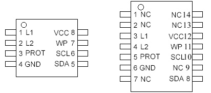

# IBM A22M Password Reading - EEPROM Restore Tool

This project provides an Arduino-based tool to read and write the AT24RF08 EEPROM chip found in IBM ThinkPad A22M laptops. This EEPROM contains the BIOS supervisor password that can be extracted and decoded.

## Hardware Information

### AT24RF08 EEPROM Chip Pinouts



#### 8-Pin AT24RF08 Package (SOIC-8)
```
Pin 4: GND     - Ground connection
Pin 5: SDA     - I2C Data line
Pin 6: SCL     - I2C Clock line
Pin 7: WP      - Write Protect (connect to GND for write operations)
```

#### 14-Pin AT24RF08 Package (SOIC-14)
```
Pin 6:  GND    - Ground connection
Pin 8:  SDA    - I2C Data line
Pin 10: SCL    - I2C Clock line
Pin 11: WP     - Write Protect (connect to GND for write operations)
```

### Arduino Connection

Connect the EEPROM to your Arduino as follows:
- **SDA** → Arduino SDA (Pin A4 on Uno/Nano, Pin 20 on Mega)
- **SCL** → Arduino SCL (Pin A5 on Uno/Nano, Pin 21 on Mega)
- **GND** → Arduino GND
- **WP** → GND (for write operations) or leave floating (for read-only)

**⚠️ IMPORTANT:** Do NOT connect VCC through the Arduino! The power supply comes from the ThinkPad itself when operational.

## Setup Instructions

1. **Hardware Connection**
   - Connect Arduino to the AT24RF08 EEPROM chip (without VCC connection)
   - Ensure WP pin is connected to GND if you plan to write data
   
2. **ThinkPad Operation**
   - Power on the ThinkPad (this provides power to the EEPROM)
   - The EEPROM is now ready for read/write operations

3. **Software Setup**
   - Upload the Arduino sketch to your board
   - Open Serial Monitor at 115200 baud rate

## Usage Instructions

### Available Commands

Once the Arduino is connected and the sketch is running, you can use the following commands in the Serial Monitor:

#### Read Operations
- `r1` - Read Block 1 (I2C address 0x54)
- `r2` - Read Block 2 (I2C address 0x55)
- `r3` - Read Block 3 (I2C address 0x56)
- `r4` - Read Block 4 (I2C address 0x57)
- `ra` - Read All blocks (1-4)

#### Load Operations (NEW!)
- `l1` - Load Block 1 backup data into write_buffer
- `l2` - Load Block 2 backup data into write_buffer
- `l3` - Load Block 3 backup data into write_buffer
- `l4` - Load Block 4 backup data into write_buffer

#### Write Operations
- `w1` - Write Block 1 (from write_buffer)
- `w2` - Write Block 2 (from write_buffer)
- `w3` - Write Block 3 (from write_buffer)
- `w4` - Write Block 4 (from write_buffer)
- `wa` - Write All blocks (includes 5-second warning)

### Example Usage

#### Backup Original Data
1. Start by reading all blocks to backup current data:
   ```
   ra
   ```
2. Save the hex output for each block using the Hex Converter Tools (see below)

#### Restore Data Workflow
1. Load backup data for specific block:
   ```
   l1    # Load Block 1 backup into write_buffer
   ```

2. Write the loaded data:
   ```
   w1    # Write Block 1 from write_buffer
   ```

3. Verify the write operation:
   ```
   r1    # Read Block 1 to verify
   ```

#### Complete Restore Process
```
# Restore all 4 blocks sequentially
l1 → w1 → r1    # Block 1
l2 → w2 → r2    # Block 2  
l3 → w3 → r3    # Block 3
l4 → w4 → r4    # Block 4
```

### Data Format

The data is displayed in hexadecimal format, with 16 bytes per line:
```
0x00: 3F 00 00 00 00 00 00 00 00 00 00 00 00 00 00 00
0x10: 00 00 00 00 00 00 00 00 00 00 00 00 00 00 00 00
...
```

## 🔧 Hex Converter Tools

This project includes convenient tools to convert Arduino hex output into C arrays for backup data:

### Quick Converter (Recommended)
**For Windows users:**
1. Double-click `tools/quick_convert.bat`
2. Paste your hex dump data (Ctrl+V)
3. Press Enter twice
4. Copy the generated C array

**For Python users:**
```bash
python tools/quick_converter.py
# Paste hex data, press Enter twice
```

### Interactive Converter (Advanced)
```bash
python tools/interactive_hex_converter.py
# Select block number (1-4)
# Paste hex data
# Automatic file saving with timestamps
```

### Converting Your EEPROM Backup

1. **Read EEPROM data:**
   ```
   ra    # Read all blocks
   ```

2. **Copy hex output for each block** (example Block 1):
   ```
   0x00: 53 45 52 23 14 0C 01 D2 C3 00 00 00 00 00 00 00
   0x10: 08 33 38 4C 33 38 34 39 5A 31 4A 30 54 33 31 41
   ...
   ```

3. **Convert to C array using tools:**
   - Run `tools/quick_convert.bat` (Windows)
   - Paste the hex data
   - Get output like:
   ```cpp
   const byte backup_blockX[256] PROGMEM = {
     0x53, 0x45, 0x52, 0x23, 0x14, 0x0C, 0x01, 0xD2,
     ...
   };
   ```

4. **Replace arrays in main.cpp:**
   - Replace `backup_block1` with Block 1 data
   - Replace `backup_block2` with Block 2 data
   - Replace `backup_block3` with Block 3 data
   - Replace `backup_block4` with Block 4 data

5. **Upload and use:**
   ```
   l1    # Load Block 1 backup data
   w1    # Write Block 1
   r1    # Verify Block 1
   ```

## Password Decoding

### IBMPASS Tool

Use the **IBMPASS** tool to decode the BIOS supervisor password from the extracted EEPROM data.

1. Extract the EEPROM data using this Arduino tool
2. Locate the password data in the hex dump
3. Use IBMPASS to decode the supervisor password
4. The decoded password can be used to access BIOS settings

## Technical Details

### EEPROM Specifications
- **EEPROM Type:** AT24RF08 (8Kbit/1KB total, organized as 4 blocks of 256 bytes each)
- **I2C Addresses:** 0x54, 0x55, 0x56, 0x57
- **Block Size:** 256 bytes per block
- **Total Capacity:** 1024 bytes (4 × 256 bytes)
- **Communication Protocol:** I2C (TWI)

### Backup Data System
- **Storage:** Backup arrays stored in PROGMEM (Flash memory)
- **RAM Usage:** Only 256 bytes for write_buffer (Arduino Pro Micro compatible)
- **Block Independence:** Each block can be loaded/written separately
- **Safety:** Original data preserved in separate arrays

### Supported Commands
| Command | Description | I2C Address | Function |
|---------|-------------|-------------|----------|
| `r1-r4` | Read individual blocks | 0x54-0x57 | Read 256 bytes from EEPROM |
| `ra` | Read all blocks | 0x54-0x57 | Complete 1KB dump |
| `l1-l4` | Load backup data | N/A | Copy from PROGMEM to RAM buffer |
| `w1-w4` | Write individual blocks | 0x54-0x57 | Write 256 bytes to EEPROM |
| `wa` | Write all blocks | 0x54-0x57 | Complete 1KB restore (dangerous) |

## Safety Notes

⚠️ **Critical Safety Information:**
- **ALWAYS** backup original EEPROM content using `ra` command before ANY write operations
- **VERIFY** backup data arrays match your original EEPROM dump before uploading
- **TEST** with `lX` and `rX` commands before using `wX` commands
- **USE** individual block operations (`w1-w4`) instead of `wa` when possible
- **KEEP** original backup data in multiple locations (files, printouts, etc.)
- **UNDERSTAND** that incorrect data can potentially brick the ThinkPad's BIOS
- **REMEMBER** the 5-second warning for `wa` operations is intentional - use it to abort if unsure

### 🛡️ Recommended Safety Workflow
1. **Backup First:** Always start with `ra` to backup original data
2. **Convert Safely:** Use hex converter tools to create proper C arrays  
3. **Test Loading:** Use `lX` commands to test data loading
4. **Verify Data:** Use `rX` commands to verify current EEPROM state
5. **Write Carefully:** Use individual `wX` commands, not `wa`
6. **Verify Writes:** Always use `rX` after `wX` to verify successful writes

## Troubleshooting

### Hardware Issues
1. **No response from EEPROM:** 
   - Check I2C connections (SDA/SCL)
   - Verify ThinkPad is powered on (provides EEPROM power)
   - Ensure proper ground connection

2. **Write operations fail:** 
   - Ensure WP pin is connected to GND
   - Check I2C pullup resistors (usually built into Arduino)
   - Verify write_buffer contains valid data (`lX` command first)

3. **Inconsistent reads:** 
   - Check power supply stability
   - Verify all ground connections
   - Try slower I2C speed if needed

### Software Issues
4. **Arduino not responding:** 
   - Verify Serial Monitor baud rate (115200)
   - Check USB cable and connection
   - Reset Arduino and reconnect

5. **Load commands not working:**
   - Ensure backup arrays are properly filled with real data
   - Check that arrays are exactly 256 bytes each
   - Verify PROGMEM syntax is correct

6. **Converter tools not working:**
   - Ensure Python is installed and in PATH
   - Check that hex data format matches expected pattern
   - Try the interactive converter for detailed error messages

### Verification & Debugging
- **Always read back written data:** Use `rX` after `wX` to verify writes
- **Compare hex dumps:** Save original `ra` output and compare after restore
- **Use individual blocks:** Test with single blocks (`l1`, `w1`, `r1`) before full restore
- **Check data integrity:** Ensure backup arrays match original EEPROM dumps exactly
- **Monitor serial output:** Watch for error codes during write operations

### Data Validation
```
# Recommended verification sequence:
ra          # Original backup
l1          # Load backup data  
r1          # Read current Block 1 (should match loaded data after w1)
w1          # Write Block 1
r1          # Verify write was successful
```

## Project Structure

```
eeprom-Read/
├── src/
│   └── main.cpp              # Main Arduino sketch with backup system
├── tools/                    # Hex converter utilities
│   ├── quick_convert.bat     # Windows batch converter (recommended)
│   ├── quick_converter.py    # Simple Python converter
│   └── interactive_hex_converter.py  # Advanced converter with options
├── docs/                     # Documentation and images
├── examples/                 # Example hex dumps and usage
├── platformio.ini           # PlatformIO configuration
└── README.md                # This file
```

## Version History

### v2.0 - Enhanced Backup System (Current)
- ✅ Added backup data arrays for all 4 blocks
- ✅ New load commands (`l1-l4`) for safe data management  
- ✅ Hex converter tools for easy backup data preparation
- ✅ PROGMEM storage to preserve RAM
- ✅ Enhanced safety warnings and verification steps
- ✅ Comprehensive documentation and troubleshooting

### v1.0 - Basic Read/Write Operations
- ✅ Basic EEPROM read/write functionality
- ✅ Individual block operations (`r1-r4`, `w1-w4`)
- ✅ Complete dump operations (`ra`, `wa`)
- ✅ I2C communication with AT24RF08
- ✅ Serial command interface

## License

This project is for **educational and legitimate recovery purposes only**. 

⚠️ **Legal Notice:**
- Use only on devices you own or have explicit permission to modify
- Respect local laws and regulations regarding computer security
- This tool is designed for password recovery, not unauthorized access
- The authors assume no responsibility for misuse or damage

**Intended Use Cases:**
- Recovering forgotten BIOS passwords on owned ThinkPad A22M laptops
- Educational purposes for understanding EEPROM and I2C communication
- Legitimate system recovery and maintenance operations
